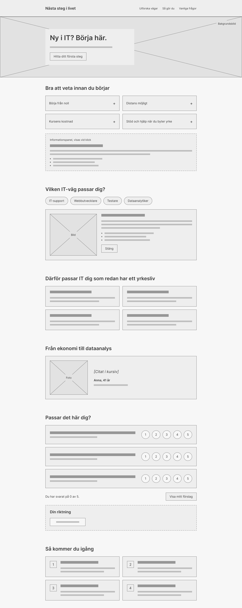

# Nästa steg i livet

## Om sidan
Sidan handlar om karriärbyte till IT i vuxen ålder och hur man får ihop det med familj och jobb. Den riktar sig till vuxna, till exempel föräldrar, som är nya i IT och undrar vilka yrken som finns, hur lång tid utbildningarna tar, vad de kostar och vilket stöd man kan få från Arbetsförmedlingen och CSN.

## Skiss
Skissen är en wireframe i gråskala som jag tog fram i Figma med hjälp av Figmas AI-funktion: [skiss/skiss-desktop.png](skiss/skiss-desktop.png).

Den färdiga sidan följer skissens upplägg och ordning, men några saker skiljer sig:

- **Hero:** i skissen ligger texten i en ruta ovanpå bakgrundsbilden. På den färdiga sidan ligger texten direkt på en mörkare bild, utan ruta, så att den blir lättare att läsa.
- **Snabbfakta:** skissen visar fyra breda rader med ett plustecken. På den färdiga sidan är det fyra mörka kort med en kort undertext, två och två, och informationspanelen öppnas under korten.
- **Passar det här dig?:** skissen har tre påståenden med skalan till höger. Den färdiga sidan har fem påståenden med skalan under varje påstående, eftersom det fungerar bättre på en smal mobilskärm. Knappen "Visa mitt förslag" ligger under räknaren i stället för till höger.
- **Vanliga frågor och sidfot:** de finns inte med i skissen, men de finns på den färdiga sidan.
- **Mobil:** jag gjorde ingen separat mobilskiss. På mobil läggs allt i en kolumn med en media query (`min-width: 700px`), och korten, bilderna och texten hamnar under varandra.
- **Färger och bilder:** skissen är i gråskala med platshållare. Färger (svart och gult), bilder och exakta texter bestämdes under bygget.

## Funktionalitet
Besökaren kan göra fyra saker. All logik finns i `script.js`, och alla funktioner kopplas med `addEventListener`.

- **Klicka på ett snabbfakta-kort** och få information om att byta yrke som vuxen, flexibilitet, kostnad och stöd. Ett nytt klick på samma kort stänger panelen. Funktioner: `handleFactClick`, `closeFacts`.
- **Välja en IT-roll** och se beskrivning, tid till första jobb, om rollen passar familjelivet och ett bra första steg. Funktioner: `handleRoleClick`, `showRole`, `hideRole`, `markActiveButton`, `clearActiveButtons`. Texterna ligger i objektet `roles`.
- **Öppna och stänga vanliga frågor**, där bara en fråga är öppen i taget. Funktioner: `toggleAnswer`, `setAnswerState`.
- **Svara på fem påståenden på en skala 1–5** och få förslag på IT-riktning. Funktioner: `handleScaleChange`, `countAnswered`, `getSuggestedRoles`, `showSuggestion`, `handleSuggestionClick`, `joinWithOr`.

Filer: `index.html` (struktur), `style.css` (utseende och responsivitet), `script.js` (interaktivitet).

## AI-användning

**Exempel 1: klickbara snabbfakta-kort**
- Vad bad jag om? Att göra korten med snabbfakta klickbara så att information visas när man klickar. Innehållet skulle handla om att det aldrig är för sent att byta yrke som vuxen, om att få ihop det med familjen, om kurser som tar 8 månader till 2 år och om stöd från Arbetsförmedlingen och CSN.
- Vad fick jag? HTML med knappar och en informationspanel, CSS för panelen och JavaScript med `handleFactClick` och `closeFacts`.
- Vad gjorde jag med det? Jag ändrade rubriker och undertexter, lade till ett fjärde kort om kostnad och tog bort en rubrik som upprepade kortets titel. Jag har testat att kortet öppnas, byter och stängs.

**Exempel 2: text om kostnad och stöd**
- Vad bad jag om? Att texten skulle säga att kurserna är gratis och betalas av regeringen.
- Vad fick jag? En formulering som begränsar gratis utbildning till yrkeshögskola, komvux och folkhögskola, med en notis om att privata kurser kan kosta pengar. Uppgifterna om CSN och Arbetsförmedlingen kom från en sökning.
- Vad gjorde jag med det? Jag behöll begränsningen, eftersom "alla kurser är gratis" inte stämmer. Jag lade till länkar till csn.se och arbetsformedlingen.se och en notis om att reglerna ändras.

**Exempel 3: kontroll mot kursens krav**
- Vad bad jag om? Att anpassa projektet efter uppgiftens krav.
- Vad fick jag? En validering med W3C:s validator som hittade två fel: ett `figcaption` som låg i en `div` och en rubrik som hoppade från `h1` till `h3`. Dessutom en omstädad CSS och en JavaScript-fil utan upprepad kod.
- Vad gjorde jag med det? Jag rättade båda felen, och sidan validerar nu utan fel.

**Exempel 4: skiss**
- Vad bad jag om? Att Figmas AI skulle skapa en wireframe i gråskala över sidans upplägg. Jag beskrev varje sektion och bad om gråa rutor i stället för bilder och text.
- Vad fick jag? En desktopskiss med alla sektioner utom vanliga frågor och sidfot.
- Vad gjorde jag med det? Jag exporterade den som PNG, lade den i mappen `skiss/` och jämförde den med den färdiga sidan. Skillnaderna står under rubriken Skiss.

## Tekniska val (VG)
- **Data i ett objekt.** Rollernas texter ligger i `roles` i `script.js`, så att funktionerna inte behöver ändras när texten ändras.
- **`<button>` för klickbara kort.** Knappar fungerar med tangentbord, och `aria-expanded` visar för skärmläsare om panelen är öppen.
- **`hidden`-attributet** döljer och visar innehåll i stället för inline-stilar.
- **`data-*`-attribut** (`data-fact`, `data-role`) kopplar knappar till rätt innehåll, så en funktion kan hantera alla kort.
- **Samma namnkonvention överallt:** engelska ord med bindestreck för filer, klasser och id (`fact-panel`, `role-button`). Tillstånd heter `is-active`.
- **CSS-variabler** för färger, rundning och gradient, så att utseendet ändras på ett ställe.
- **Mobil först.** Grundreglerna gäller mobil, och en media query (`min-width: 700px`) lägger kort, bild och text bredvid varandra på större skärmar.
- **Flexbox** används för all placering.

## Bedömning av AI-innehåll (VG)
Jag jämförde det AI gav mig med uppgiftens krav och med vad som faktiskt stämmer.

- **Behöll:** funktionsindelningen i JavaScript, `<button>`-lösningen och CSS-variablerna.
- **Ändrade:** texten om att kurser är gratis, så att den bara gäller utbildningar som staten eller kommunen finansierar. Jag ändrade också tidsangivelserna så att de ligger mellan 8 månader och 2 år.
- **Tog bort:** upprepade rubriker och regler i CSS som skrevs över längre ner i filen, samt kod som upprepades i JavaScript.
- **Kontrollerade:** HTML med W3C:s validator och CSS-validatorn. Uppgifterna om CSN har villkor och ändras, därför står det "under vissa villkor" och det finns länkar till källorna.
